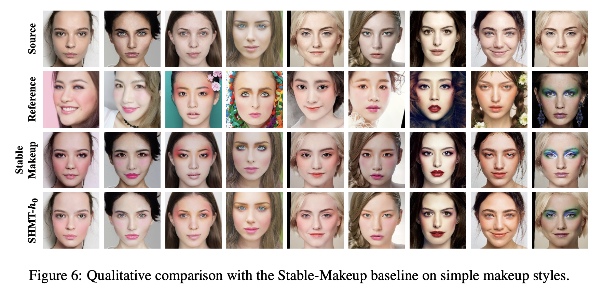
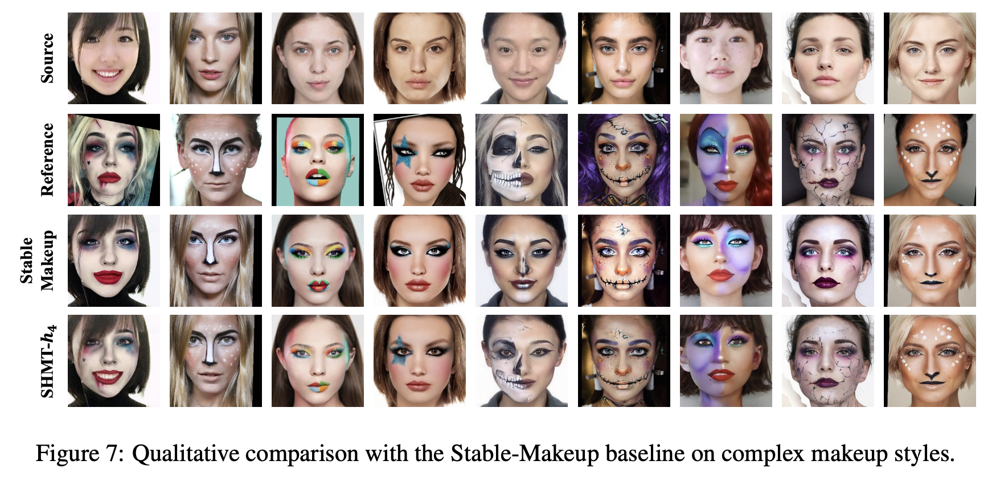

# [NeurIPS 2024] SHMT: Self-supervised Hierarchical Makeup Transfer via Latent Diffusion Models

This is the official pytorch code for **"SHMT: Self-supervised Hierarchical Makeup Transfer via Latent Diffusion Models"**, which has been accepted by NeurIPS2024.

**The training code, testing code, and pre-trained model have all been open sourced.**

We reorganized the code and verified that it can train and infer correctly.

## Author
**Zhaoyang Sun; Shengwu Xiong; Yaxiong Chen; Fei Du; Weihua Chen; Fan Wang; Yi Rong**

Work done during internship of Zhaoyang Sun at DAMO Academy, Alibaba Group.

## News 

+ Our paper SHMT was accepted by NeurIPS2024. [Paper link](https://arxiv.org/abs/2412.11058) and [code link](https://github.com/Snowfallingplum/SHMT).

+ Our paper CSD-MT was accepted by CVPR2024. [Paper link](https://arxiv.org/abs/2405.17240) and [code link](https://github.com/Snowfallingplum/CSD-MT).

+ Our paper SSAT++ was accepted by TNNLS2023. [Paper link](https://ieeexplore.ieee.org/document/10328655) and [code link](https://github.com/Snowfallingplum/SSAT_plus).

+ Our paper SSAT was accepted by AAAI2022. [Paper link](https://arxiv.org/abs/2112.03631) and [code link](https://github.com/Snowfallingplum/SSAT).


## Framework


## Requirements

A suitable [conda](https://conda.io/) environment named `ldm` can be created
and activated with:

```
conda env create -f environment.yaml
conda activate ldm
```

## Quick Start
1. Download a pretrained autoencoding models from [LDM](https://github.com/CompVis/latent-diffusion), VQ-f4 is selected in our experiment.
2. Download the pre trained model and place it in the checkpoints folder. [Google Drive](https://drive.google.com/drive/folders/1UJDdGCeE6qEqr3yi6BK1tEkwnjVKQDZY).
3. We have provided some examples, just execute inference directly. **Please modify the parameters in the scripts according to your own situation**

``` 
# SHMT-h0
CUDA_VISIBLE_DEVICES=0 python makeup_inference_h0.py --outdir inference_h0_results --config configs/latent-diffusion/shmt_h0.yaml --ckpt logs/2024-12-20T12-01-44_shmt_h0/checkpoints/epoch=00800.ckpt --source_image_path examples/images/non_makeup --source_seg_path examples/seg2/non_makeup --source_depth_path examples/3d/non_makeup --ref_image_path examples/images/makeup --ref_seg_path examples/seg2/makeup --seed 321 --ddim_steps 50 
```

``` 
# SHMT-h4
CUDA_VISIBLE_DEVICES=0 python makeup_inference_h4.py --outdir inference_h4_results --config configs/latent-diffusion/shmt_h4.yaml --ckpt logs/2024-12-20T12-01-44_shmt_h4/checkpoints/epoch=00700.ckpt --source_image_path examples/images/non_makeup --source_seg_path examples/seg2/non_makeup --source_depth_path examples/3d/non_makeup --ref_image_path examples/images/makeup --ref_seg_path examples/seg2/makeup --seed 321 --ddim_steps 50 

# In SHMT-h4, it is recommended to use the following script for inference
CUDA_VISIBLE_DEVICES=0 python makeup_inference_model2.py --outdir inference_model2_results_0.5 --config configs/latent-diffusion/shmt_h4.yaml --ckpt logs/2024-12-23T03-17-15_shmt_h4/checkpoints/epoch=00700.ckpt --config2 configs/latent-diffusion/shmt_h0.yaml --ckpt2 logs/2024-12-21T04-48-40_shmt_h0/checkpoints/epoch=00800.ckpt --source_image_path examples/images/non_makeup --source_seg_path examples/seg2/non_makeup --source_depth_path examples/3d/non_makeup --ref_image_path examples/images/makeup --ref_seg_path examples/seg2/makeup --seed 321 --ddim_steps 50 --proportionOFmodel1 0.5

```

## Trainning Dataset
1. Download dataset. MT dataset can be downloaded here [BeautyGAN](https://github.com/wtjiang98/BeautyGAN_pytorch). Adding the datasets of [Wild-MT](https://github.com/wtjiang98/PSGAN) and [LADN](https://github.com/wangguanzhi/LADN.) should yield better results. Merge non-makeup and makeup images, placing all images in the same folder.
2. Prepare face parsing. Face parsing is used in this code. In our experiment, face parsing is generated by https://github.com/TracelessLe/FaceParsing.PyTorch. (Different from the model in previous papers)
3. Prepare face 3d. [3DDFA_V2](https://github.com/cleardusk/3DDFA_V2) is used to get face 3d. And we set args.opt='3d' and args.show_flag=“Flase”.
4. Data preparation. Prepare data according to the following catalogue structure.
```
/MakeupData/train/
├── images # original images
│   ├── 00001.jpg
│   ├── 00002.jpg
│   ├── ...
├── segs # face parsing
│   ├── 00001.jpg
│   ├── 00002.jpg
│   ├── ...
├── 3d # 3d 
│   ├── 00001_3d.jpg
│   ├── 00002_3d.jpg
│   ├── ...
```

## The Trainning of SHMT

1. Download a pretrained autoencoding models from [LDM](https://github.com/CompVis/latent-diffusion), VQ-f4 is selected in our experiment.

2. Change the pre-trained model path and data path of the configuration file to your own. The configuration file is in './configs/latent-diffusion/'

3. Execution of training scripts.
``` 
CUDA_VISIBLE_DEVICES=0 python main.py --base configs/latent-diffusion/shmt_h0.yaml -t --gpus 0, 
CUDA_VISIBLE_DEVICES=0 python main.py --base configs/latent-diffusion/shmt_h4.yaml -t --gpus 0, 
```

## The Inference of SHMT
1. Data preparation. Prepare data according to the following catalogue structure. We have provided some examples.
```
/examples/
├── images # original images
│   ├── non_makeup 
│   │   ├── 00001.jpg
│   │   ├── 00002.jpg
│   │   ├── ...
│   ├── makeup 
│   │   ├── 00001.jpg
│   │   ├── 00002.jpg
│   │   ├── ...
├── seg2 # original images
│   ├── non_makeup 
│   │   ├── 00001.jpg
│   │   ├── 00002.jpg
│   │   ├── ...
│   ├── makeup 
│   │   ├── 00001.jpg
│   │   ├── 00002.jpg
│   │   ├── ...
├── 3d # only the 3d image of non_makeup
│   ├── non_makeup 
│   │   ├── 00001.jpg
│   │   ├── 00002.jpg
│   │   ├── ...
```
2. Execution of inference scripts. **Please modify the parameters in the scripts according to your own situation**

``` 
# SHMT-h0
CUDA_VISIBLE_DEVICES=0 python makeup_inference_h0.py --outdir inference_h0_results --config configs/latent-diffusion/shmt_h0.yaml --ckpt logs/2024-12-20T12-01-44_shmt_h0/checkpoints/epoch=00800.ckpt --source_image_path examples/images/non_makeup --source_seg_path examples/seg2/non_makeup --source_depth_path examples/3d/non_makeup --ref_image_path examples/images/makeup --ref_seg_path examples/seg2/makeup --seed 321 --ddim_steps 50 
```

``` 
# SHMT-h4
CUDA_VISIBLE_DEVICES=0 python makeup_inference_h4.py --outdir inference_h4_results --config configs/latent-diffusion/shmt_h4.yaml --ckpt logs/2024-12-20T12-01-44_shmt_h4/checkpoints/epoch=00700.ckpt --source_image_path examples/images/non_makeup --source_seg_path examples/seg2/non_makeup --source_depth_path examples/3d/non_makeup --ref_image_path examples/images/makeup --ref_seg_path examples/seg2/makeup --seed 321 --ddim_steps 50 

# In SHMT-h4, it is recommended to use the following script for inference
CUDA_VISIBLE_DEVICES=0 python makeup_inference_model2.py --outdir inference_model2_results_0.5 --config configs/latent-diffusion/shmt_h4.yaml --ckpt logs/2024-12-23T03-17-15_shmt_h4/checkpoints/epoch=00700.ckpt --config2 configs/latent-diffusion/shmt_h0.yaml --ckpt2 logs/2024-12-21T04-48-40_shmt_h0/checkpoints/epoch=00800.ckpt --source_image_path examples/images/non_makeup --source_seg_path examples/seg2/non_makeup --source_depth_path examples/3d/non_makeup --ref_image_path examples/images/makeup --ref_seg_path examples/seg2/makeup --seed 321 --ddim_steps 50 --proportionOFmodel1 0.5

```
## The results of our SHMT





## Citation

If this work is helpful for your research, please consider citing the following BibTeX entry.

```text
@article{sun2024shmt,
  title={SHMT: Self-supervised Hierarchical Makeup Transfer via Latent Diffusion Models},
  author={Sun, Zhaoyang and Xiong, Shengwu and Chen, Yaxiong and Du, Fei and Chen, Weihua, and Wang, Fang and Rong, Yi}
  journal={Advances in neural information processing systems},
  year={2024}
}
```

## Comments

- Our code for the SHMT models builds heavily on [LDM](https://github.com/CompVis/latent-diffusion)
  and [Paint-by-Example](https://github.com/Fantasy-Studio/Paint-by-Example). 
  Thanks for open-sourcing!

## License

This work is licensed under a
[Creative Commons Attribution-NonCommercial-ShareAlike 4.0 International License][cc-by-nc-sa].

[![CC BY-NC-SA 4.0][cc-by-nc-sa-image]][cc-by-nc-sa]

[cc-by-nc-sa]: http://creativecommons.org/licenses/by-nc-sa/4.0/
[cc-by-nc-sa-image]: https://licensebuttons.net/l/by-nc-sa/4.0/88x31.png
[cc-by-nc-sa-shield]: https://img.shields.io/badge/License-CC%20BY--NC--SA%204.0-lightgrey.svg

