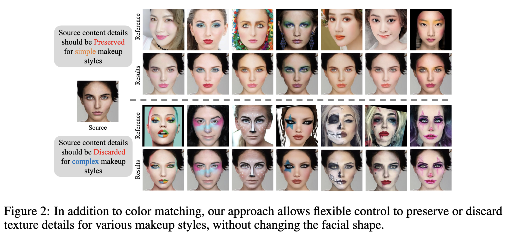
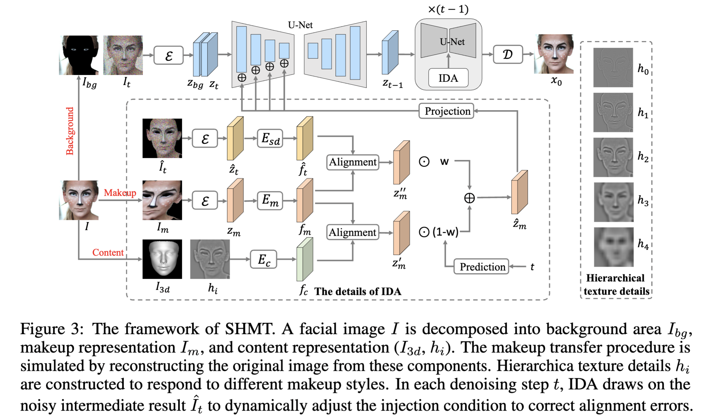

# SHMT
[NeurIPS 2024] SHMT: Self-supervised Hierarchical Makeup Transfer via Latent Diffusion Models. 

Work done during internship of Zhaoyang Sun at DAMO Academy, Alibaba Group.

## News 

+ Our previous work " Content-Style Decoupling for Unsupervised Makeup Transfer without Generating Pseudo Ground Truth" was accepted by CVPR2024. [Paper link](https://arxiv.org/abs/2405.17240) and [code link](https://github.com/Snowfallingplum/CSD-MT).

## The results of our SHMT



## Framework



## Requirements

A suitable [conda](https://conda.io/) environment named `ldm` can be created
and activated with:

```
conda env create -f environment.yaml
conda activate ldm
```

## The Trainning of SHMT
1. Download a pretrained autoencoding models from [LDM](https://github.com/CompVis/latent-diffusion), VQ-f4 is selected in our experiment.
2. Data preparation. Prepare data according to the following catalogue structure.
```
/MakeupData/train/
├── images # original images
│   ├── 00001.jpg
│   ├── 00002.jpg
│   ├── ...
├── segs # face parsing
│   ├── 00001.jpg
│   ├── 00002.jpg
│   ├── ...
├── 3d # 3d 
│   ├── 00001_3d.jpg
│   ├── 00002_3d.jpg
│   ├── ...
```
3. Change the pre-trained model path and data path of the configuration file to your own. The configuration file is in './configs/latent-diffusion/'

4. Execution of training scripts.
``` 
CUDA_VISIBLE_DEVICES=0 python main.py --base configs/latent-diffusion/shmt_h0.yaml -t --gpus 0, 
CUDA_VISIBLE_DEVICES=0 python main.py --base configs/latent-diffusion/shmt_h4.yaml -t --gpus 0, 
```

## The Inference of SHMT
1. Data preparation. Prepare data according to the following catalogue structure.
```
/MakeupData/test/
├── images # original images
│   ├── non_makeup 
│   │   ├── 00001.jpg
│   │   ├── 00002.jpg
│   │   ├── ...
│   ├── makeup 
│   │   ├── 00001.jpg
│   │   ├── 00002.jpg
│   │   ├── ...
├── segs # original images
│   ├── non_makeup 
│   │   ├── 00001.jpg
│   │   ├── 00002.jpg
│   │   ├── ...
│   ├── makeup 
│   │   ├── 00001.jpg
│   │   ├── 00002.jpg
│   │   ├── ...
├── 3d # only the 3d image of non_makeup
│   ├── non_makeup 
│   │   ├── 00001.jpg
│   │   ├── 00002.jpg
│   │   ├── ...
```
2. Execution of inference scripts.
```
CUDA_VISIBLE_DEVICES=0 python makeup_inference_h0.py \
  --outdir your_output_dir \
  --config configs/latent-diffusion/shmt_h0.yaml \
  --ckpt your_ckpt_path \
  --source_image_path your_non_makeup_images_path \
  --source_seg_path your_non_makeup_segs_path \ 
  --source_depth_path your_non_makeup_3d_path \ 
  --ref_image_path your_makeup_images_path \
  --ref_seg_path your_makeup_segs_path \ 
  --seed 321 \ 
  --ddim_steps 50
```
```
CUDA_VISIBLE_DEVICES=0 python makeup_inference_h4.py \
  --outdir your_output_dir \
  --config configs/latent-diffusion/shmt_h4.yaml \
  --ckpt your_ckpt_path \
  --source_image_path your_non_makeup_images_path \
  --source_seg_path your_non_makeup_segs_path \ 
  --source_depth_path your_non_makeup_3d_path \ 
  --ref_image_path your_makeup_images_path \
  --ref_seg_path your_makeup_segs_path \ 
  --seed 321 \ 
  --ddim_steps 50
```

## Citation

If this work is helpful for your research, please consider citing the following BibTeX entry.

```text
@article{sun2024shmt,
  title={SHMT: Self-supervised Hierarchical Makeup Transfer via Latent Diffusion Models},
  author={Sun, Zhaoyang and Xiong, Shengwu and Chen, Yaxiong and Du, Fei and Chen, Weihua, and Wang, Fang and Rong, Yi}
  journal={Advances in neural information processing systems},
  year={2024}
}
```

## Comments

- Our code for the SHMT models builds heavily on [LDM](https://github.com/CompVis/latent-diffusion)
  and [Paint-by-Example](https://github.com/Fantasy-Studio/Paint-by-Example). 
  Thanks for open-sourcing!

## License

This work is licensed under a
[Creative Commons Attribution-NonCommercial-ShareAlike 4.0 International License][cc-by-nc-sa].

[![CC BY-NC-SA 4.0][cc-by-nc-sa-image]][cc-by-nc-sa]

[cc-by-nc-sa]: http://creativecommons.org/licenses/by-nc-sa/4.0/
[cc-by-nc-sa-image]: https://licensebuttons.net/l/by-nc-sa/4.0/88x31.png
[cc-by-nc-sa-shield]: https://img.shields.io/badge/License-CC%20BY--NC--SA%204.0-lightgrey.svg

